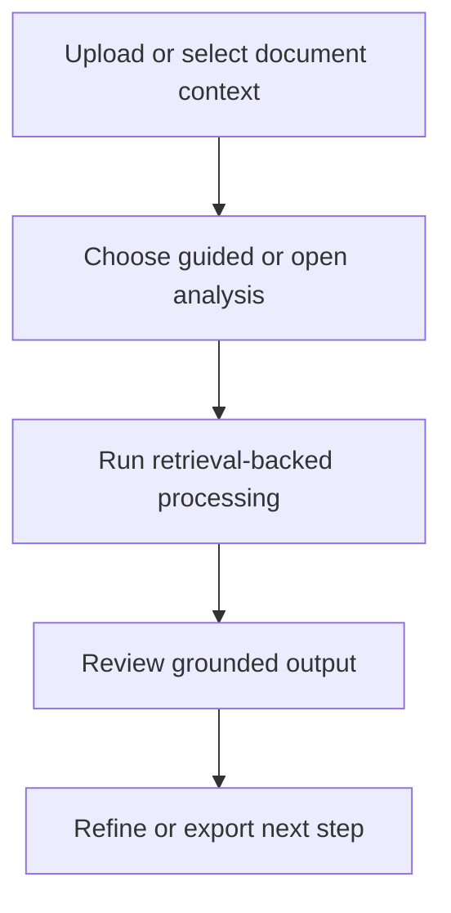

# Workflow

## High-level functional workflow
1. Upload or select document context
2. Choose guided or open analysis
3. Run retrieval-backed processing
4. Review grounded output
5. Refine or export next step

## Publication boundary
- The workflow is intentionally simplified.
- No internal rules, private thresholds, or sensitive processing detail are described here.
